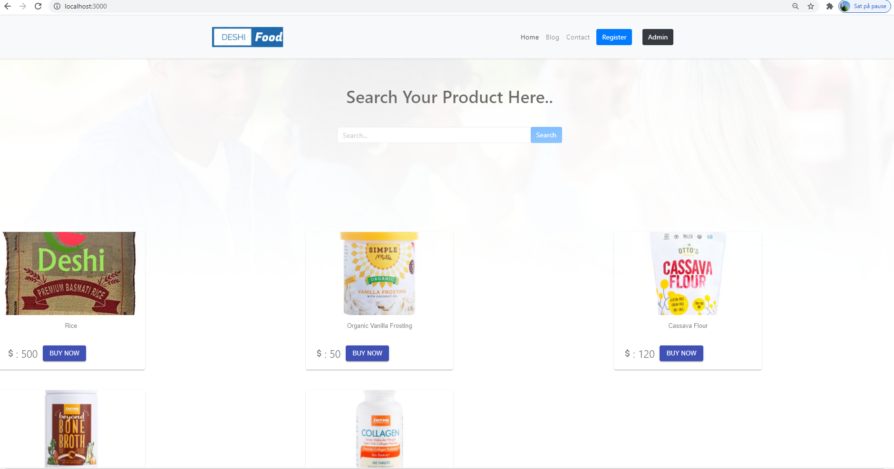
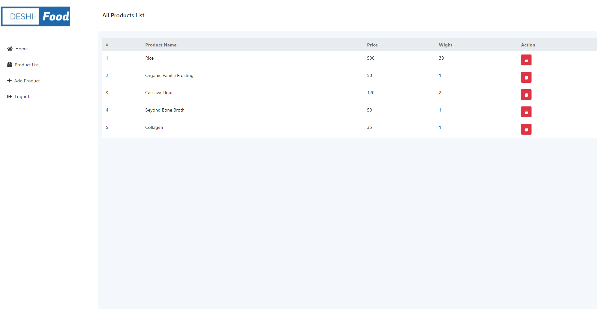

# Project: Deshi Food simple ecommerce app.
<h1><a href="https://hero-assignment-10.web.app">Live</a></h2>
## Feature

This is full stack simple applicaion. Here user can select a product and checkout that product. Before checkout user needs Authentication. Admin can create a product and manage those products.

## Technology

- React JS
- Firebase Authentication (Google, Email/ Password)
- React Router, Private Router
- React Hook Form
- React Context API
- React Hook
- Firebase Hosting
- Bootstrap
- CSS3
- Materiul UI

<h2>Project screenshot</h2>

 
